# Курсовая работа ahj

<a href=https://satriks.github.io/ahj_courseWork_client target=”_blank”>Страница на github</a>

## Легенда

Мы всё больше привыкаем к неформальному формату организации информации, где ключевое — не структура, а удобство и поиск. Примеры: Slack, Telegram, WhatsApp, вплоть до помощников типа Siri или Алиса.

## Основная концепция

Ключевая идея — создать бота, предназначенного для хранения информации, поиска и других сервисов: напоминания, уведомления и интеграции с внешними сервисами.

Назовём это глобальным ботом-органайзером: вы закидывате туда всю информацию, которая вам нужна, а он сортирует, обеспечивает поиск, хранение и напоминание.

## Реализованно :

### Обязательные для реализации функции:

#### Сохранение в истории ссылок и текстовых сообщений;
    
    при открытии страницы история сохраняется: 

#### Ссылки (`http://` или `https://`) должны быть кликабельны и отображаться, как ссылки;

    ссылки кликабельны и отображаются :

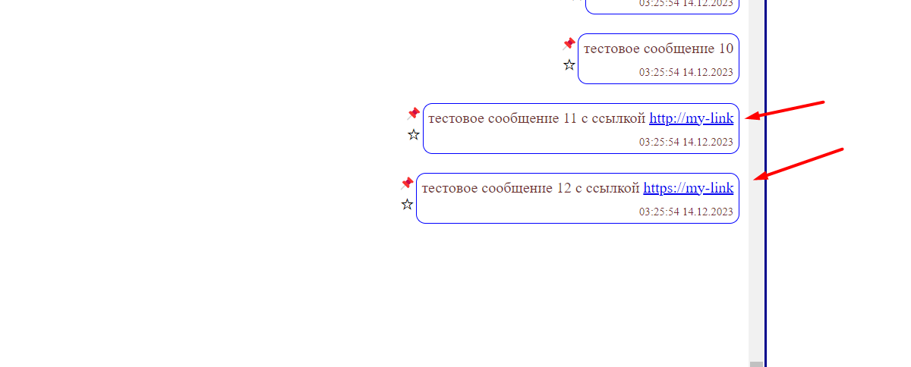

#### сохранение в истории изображений, видео и аудио (как файлов) — через Drag & Drop и через иконку загрузки;

#### Через Drag & Drop

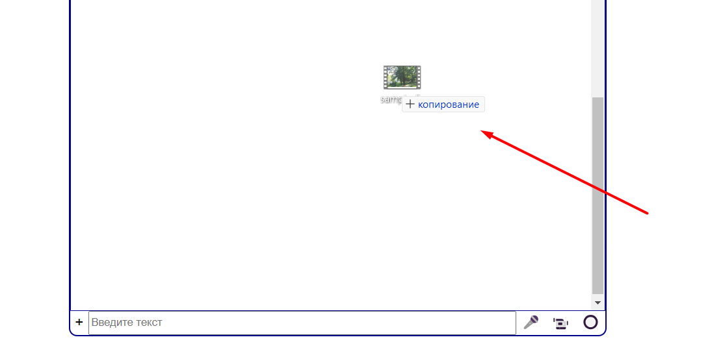
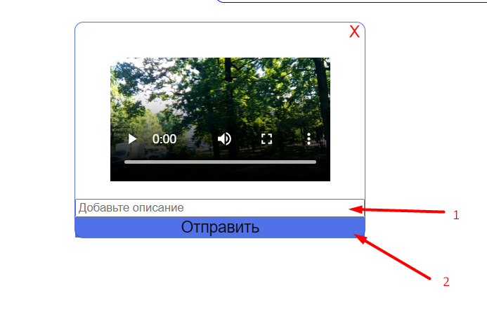
    

    0 Перетащите нужный файл

    1 Добавьте описание

    2 Нажмите Enter или кнопку "отправить" 

#### Через добавление файла

    0 Нажмите на значек "+"

    1 выберете add file

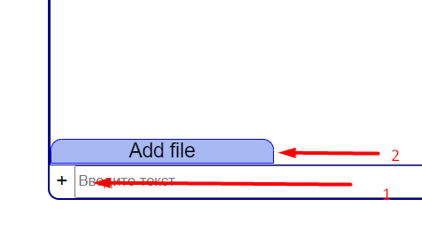
    
    2 выберете нужный файл 
    
 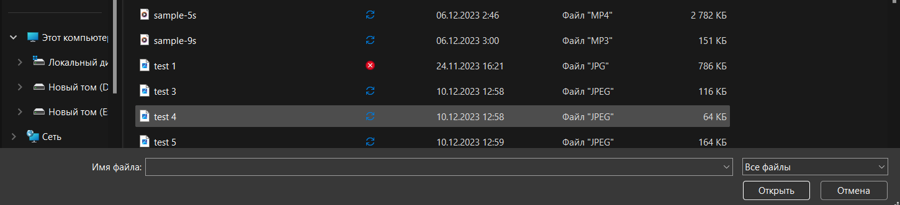

    3 добавьте описание 

    4 Нажмите "Enter" или кнопку "отправить" 

#### Скачивание файлов на компьютер пользователя;

    Для скачивания файл нажмите на иконку:

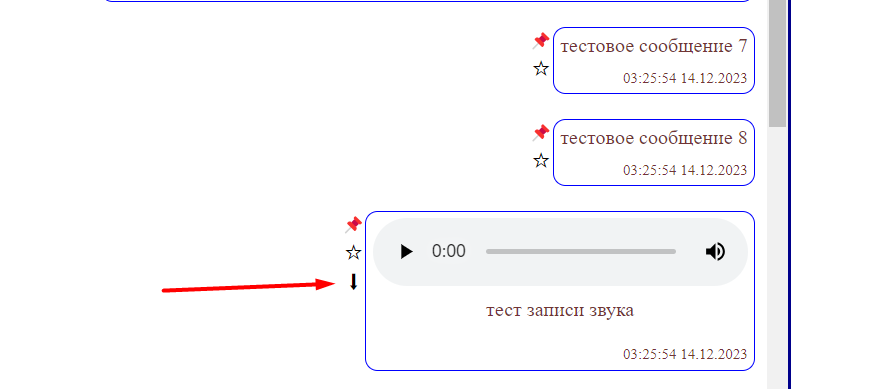

#### Ленивая подгрузка: сначала подгружаются последние 10 сообщений, при прокрутке вверх подгружаются следующие 10 и т. д.

    При открытии страницы появляются последние 10 сообщений, при прокрутке наверх постепенно добавляются предыдущие посты

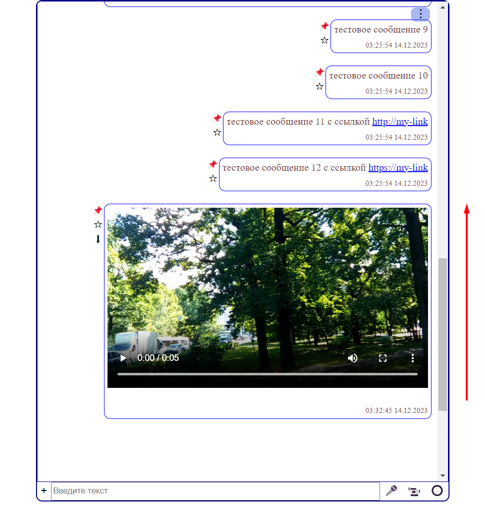

### Дополнительные функции:

 #### Синхронизация: если приложение открыто в нескольких окнах или вкладках, то контент должен быть синхронизирован;   

 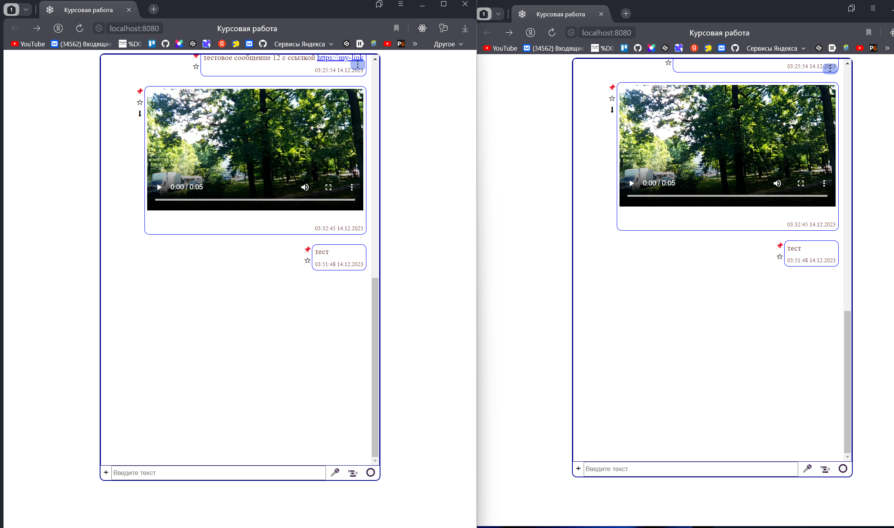    
 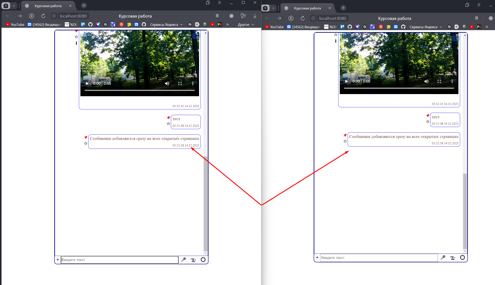    

#### Поиск по сообщениям (интерфейс + реализация на сервере);
   
    
    Для поиска :

    0 Нажмите на кнопку "..." в верхней части окна сообщений

    1 Выберите "Поиск"

 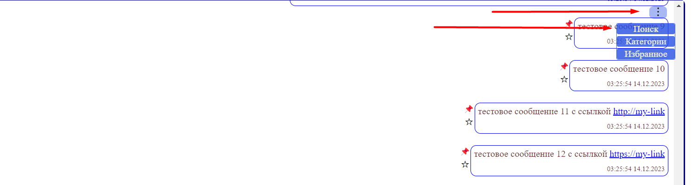  
 
    2 В появившейся строке введите интересующее Вам словосочетание и нажмите "Enter"

   

    3 В зоне сообщений вы увидите посты соответствующие запросу
 
 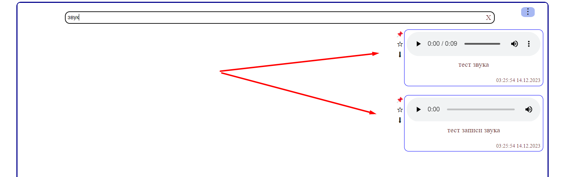  

    4 Что бы отменить фильтрацию нажмите на крестик на строке поиска

#### Запись видео и аудио, используя API браузера;

    Кнопки видео и аудио записи находятся внизу справа. 

    Для начала записи нажмите на кнопку.

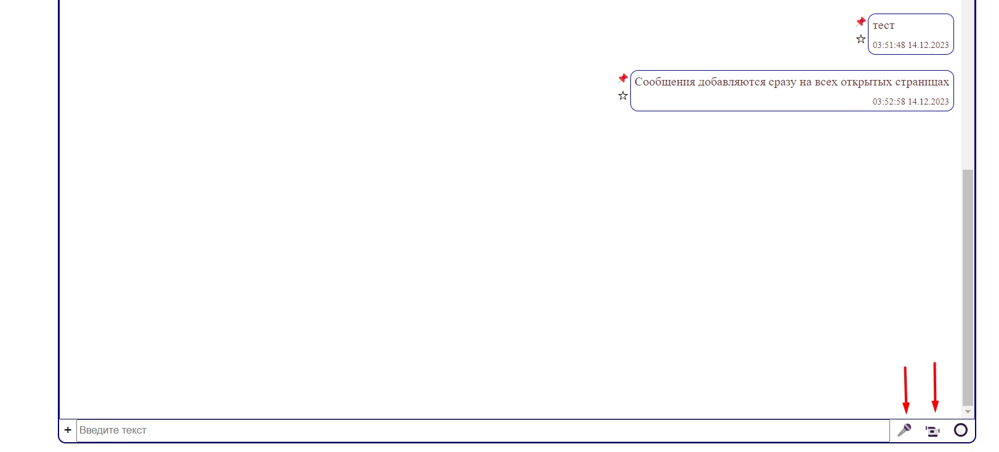 

    Остановить запись можно нажав на ту же кнопку

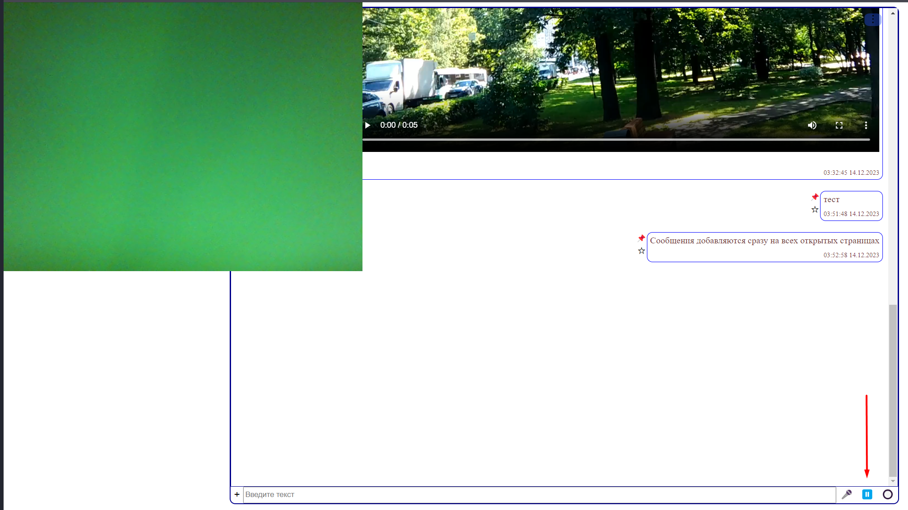 

#### Отправка геолокации;

    При нажатии на кнопку в чат добавится сообщение с текущей геолокацией

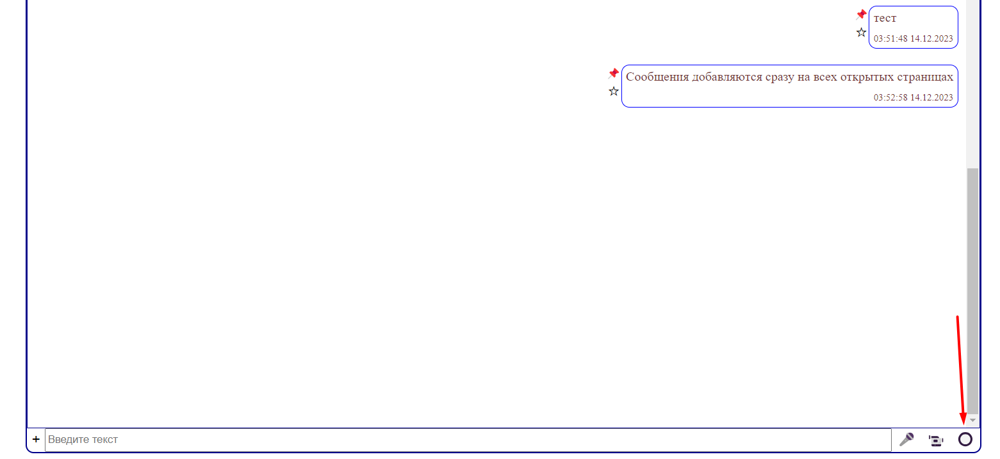 

#### Просмотр вложений по категориям: аудио, видео, изображения, другие файлы (см. боковое меню Telegram);

    Для просмотра категорий нажмите на кнопку "..." в правой верхней части области сообщений и выберете пункт "категории"

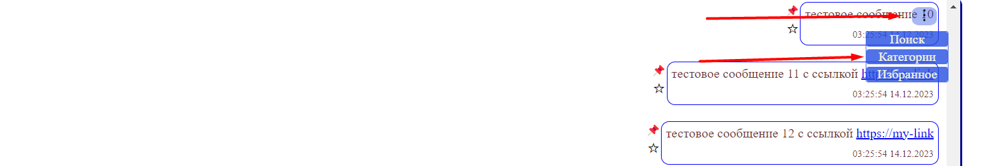 

    Появится меню где показано сколько и каких постов сейчас имеется 

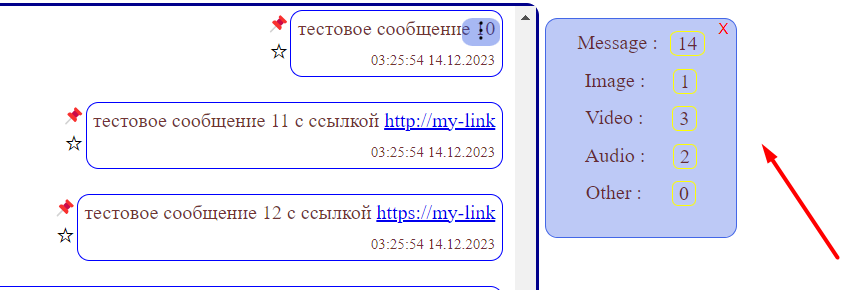

    При нажатии на категорию произойдет фильтрация и вы увидите посты только данного типа.
    Для отмены нажмите на кнопку "х"

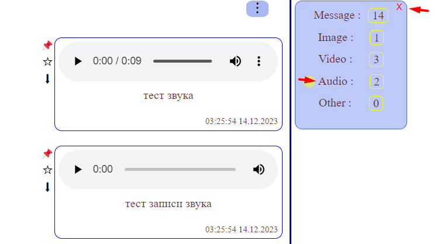 

#### Закрепление (pin) сообщений: закреплять можно только одно сообщение, оно прикрепляется к верхней части страницы

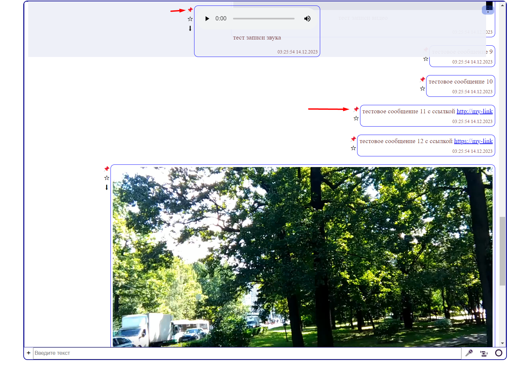

    Для закрепления поста нажмите на иконку. 

    Может быть закреплен только 1н пост.  При попытке добавить новый, он заменит уже закрепленный.

    Для отмены закрепления нажмите на такую же иконку у закрепленного поста.

#### Добавление сообщения в избранное, должен быть интерфейс для просмотра избранного;

Что бы добавить пост в избранное нажмите на иконку.

Для просмотра избранных постов нажмите на кнопку "..." в правой верхней части области сообщений и выберете пункт "Избранное"

В области показа сообщений вы увидите избранные посты

Для выхода нажмите на кнопку "Выйти из избранного"

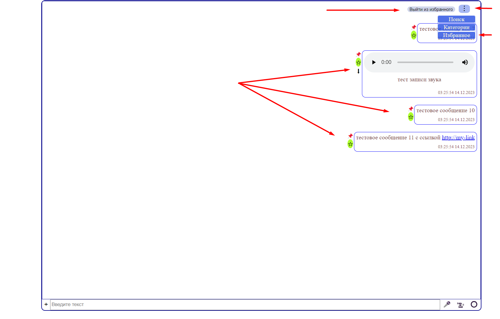

